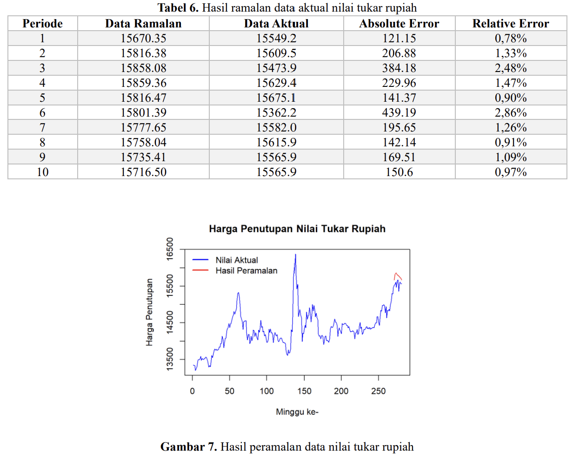
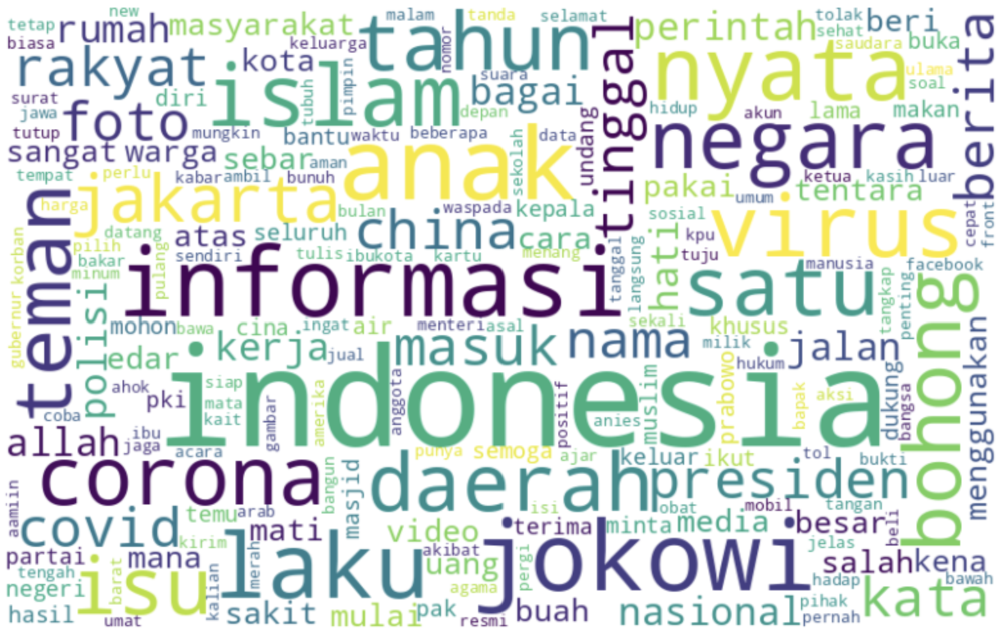
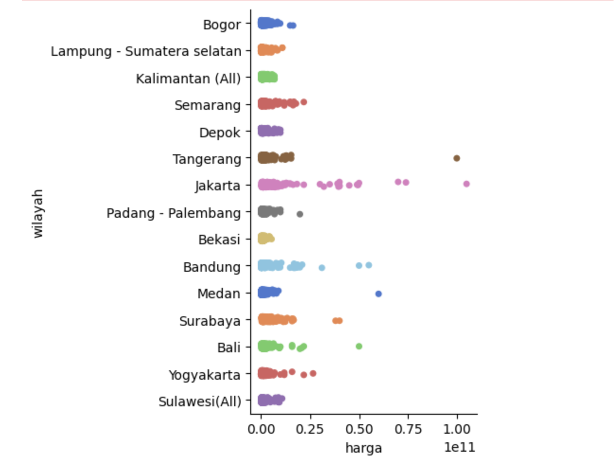
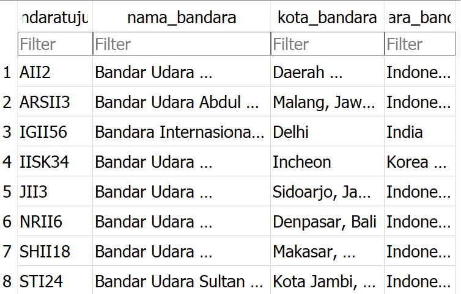
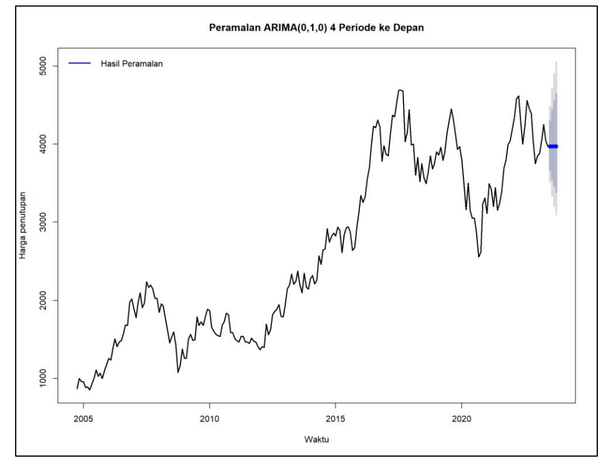
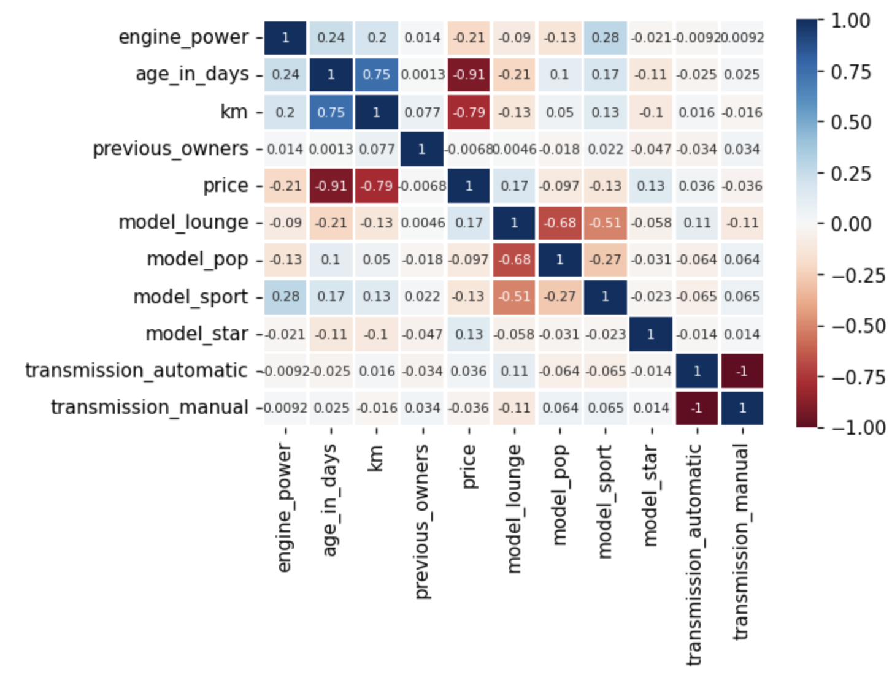
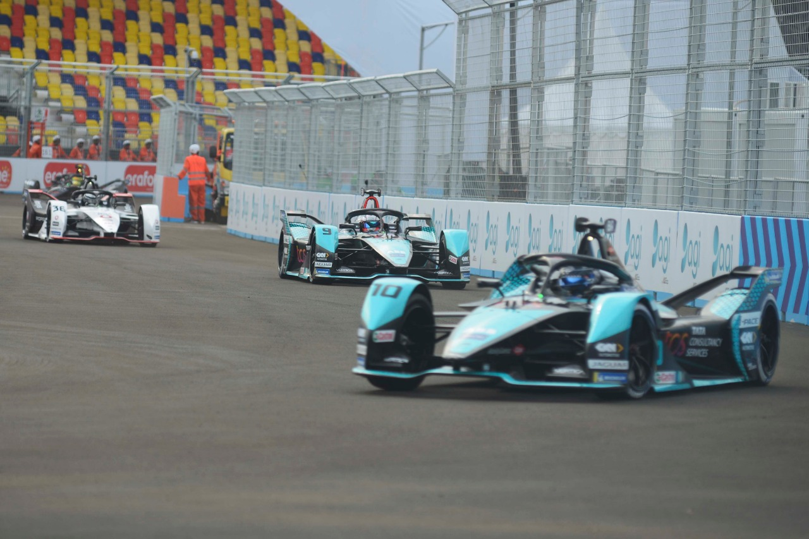
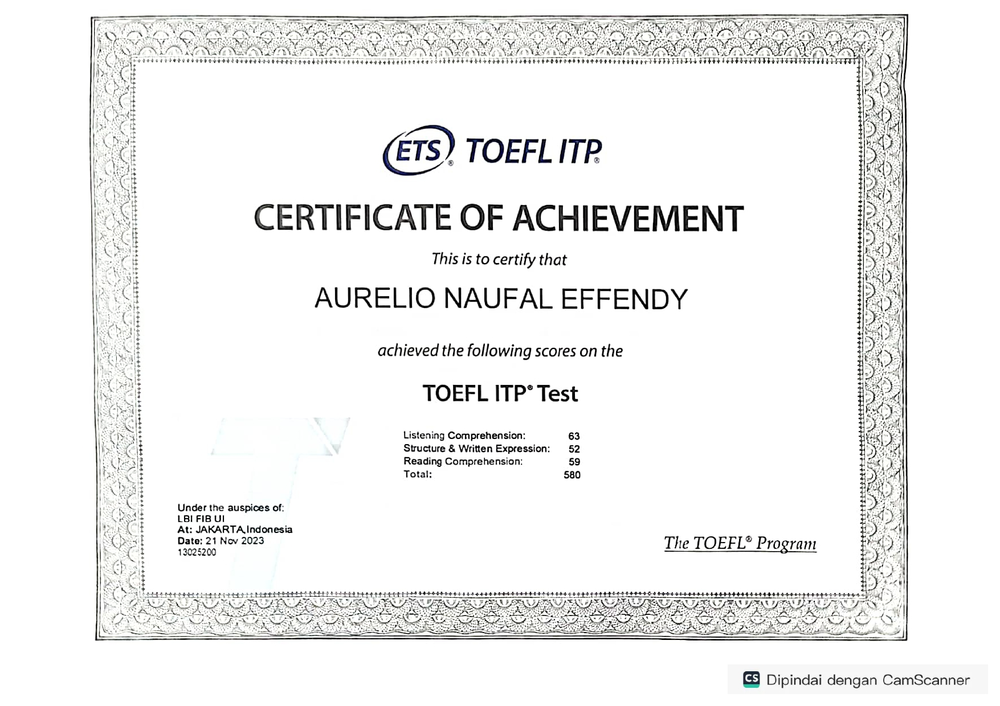
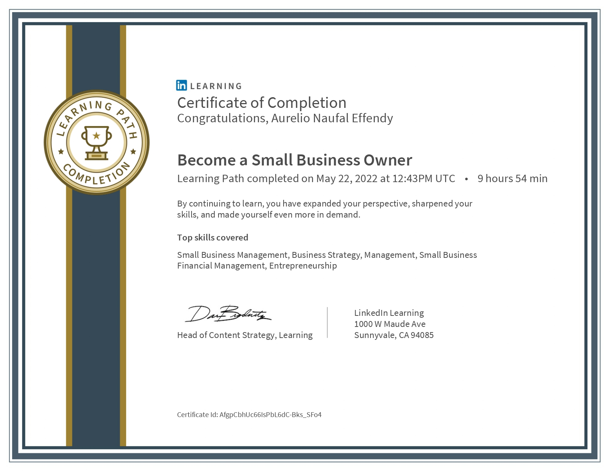

## Profile
I am an undergraduate statistics student at University of Indonesia who is passionate about diving into the world of data and analysis. With a keen interest in learning, I am always seeking new opportunities to expand my skillset and broaden my horizons. My ability to quickly grasp complex concepts allows me to efficiently adapt to challenges, ensuring that I stay ahead in the fast-paced realm of statistics. I am dedicated to continuously grow myself, both personally and professionally. My academic foundation as well as my enthusiasm for learning allows me to effectively contribute and excel in any data-driven role.

My github link : https://github.com/Aurelio-Naufal

## Projects

### Transactional Data and Market Basket Analysis at The Daily Foodhall Menara Astra and Istana Sahid Sudirman
May 2024

Internship's innovation project at PT Swalayan Sukses Abadi (The Foodhall) which is under the management of PT Mitra Adiperkasa Tbk. Made an analysis on 4 months (January - April 2024) transactional data at the two foodhall's minimarkets, Daily Foodhall Menara Astra and Daily Foodhall Istana Sahid Sudirman. Visualized, compared, and analyzed the revenue generated, most purchased items, transaction date (to find which month, day, and time are the busiest in terms of transaction traffic), and other aspects on both stores to create new insights and recommendations. Performed market basket analysis to see which products are related and great to sell together, then proposed promo or bundle recommendations on some items to improve sales. Unfortunately, because the data is confidential, this project can't be uploaded.

### Paper Replication - Application of ARIMA-GARCH model in forecasting IDR to dollar exchange rate in 2017-2022
December 2023

Replicated a paper about Application of ARIMA-GARCH model in forecasting IDR to dollar exchange rate in 2017-2022. Even though the data has been taken from the same source and over the same time period exactly as stated in the previous literature study, There are few differences in values resulting a slight difference in model estimation. The project can be accessed [here](https://github.com/Aurelio-Naufal/Application-of-ARIMA-GARCH-model-in-forecasting-IDR-to-dollar-exchange-rate-in-2017-2022)

### Hoax Data Classification Text Analytics
Novemeber 2023

Worked with 3 other people to Analyzed hoax data from mafindo by visualizing the text data, determining the best model and classifying the text data based on the model. The project can be accessed [here](https://github.com/Aurelio-Naufal/Case-Study-Data-Mining-Aplikasi-Model-Klasifikasi-Kelompok-8)

### Exploratory Data Analysis For Property Data in Indonesia
October 2023

Worked with 3 other people, applied Exploratory Data Analysis and searched for insights from the property data in Indonesia in order to answer the question, Which city has the best opportunity to build a property business? The project can be accessed [here](https://github.com/Aurelio-Naufal/Case-Study-Data-Mining-EDA-Data-Property-Indonesia)

### Airport System Database
June 2023

Worked with 4 other people to create a database for airport system with SQLite. The project can be accessed [here](https://github.com/Aurelio-Naufal/Project-Database-Sistem-Bandara/blob/main/Laporan%20Akhir%20Database%20Kelompok%204.pdf)

### Forecasting TLKM Stock Price
June 2023

Worked with 2 other people, applied time series analysis to forecast TLKM stock price with ARIMA Model using R programming language. The project can be accessed [here](https://github.com/Aurelio-Naufal/Forecasting-TLKM-stock-price-with-ARIMA-model)

### Implementation of Cox Proportional Hazards in Heart Failure Survival Modeling
May 2023

Worked with 5 other people, implemented cox proportional hazards survival model in heart failure data. The project can be accessed [here](https://github.com/Aurelio-Naufal/Case-Study-Cox-Regression)

### Used Car Price Prediction Model
December 2022

Worked with 4 other people, predicted used car price with linear model and searched for insights. The project can be accessed [here](https://github.com/Aurelio-Naufal/Project-Linear-Model-Used-Car-Price-Prediction-Model)

### Social Media Analytics about Formula E topic in Indonesia
June 2022

Worked with 3 other people, analyzed the sentiment of public about Formula E topic in Indonesia during the event. The social media data is obtained from Twitter (Currently called X) API. The project can be accessed [here](https://github.com/Aurelio-Naufal/Project-Social-Media-Analytics)

## Certificates
### TOEFL ITP Score 580

### SQL Certification From Linkedin Learning

### Small Business Owner Certification From Linkedin Learning

